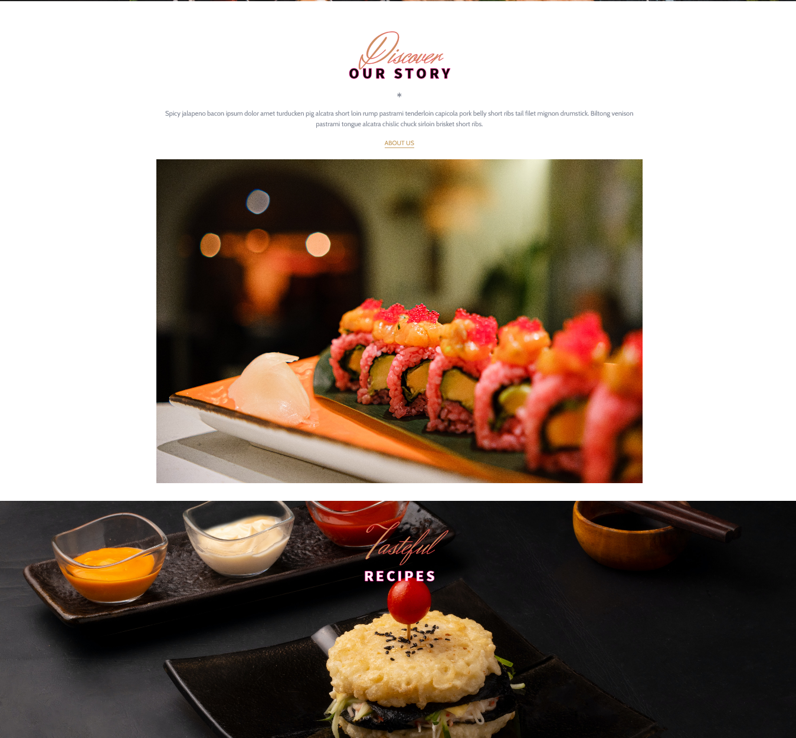
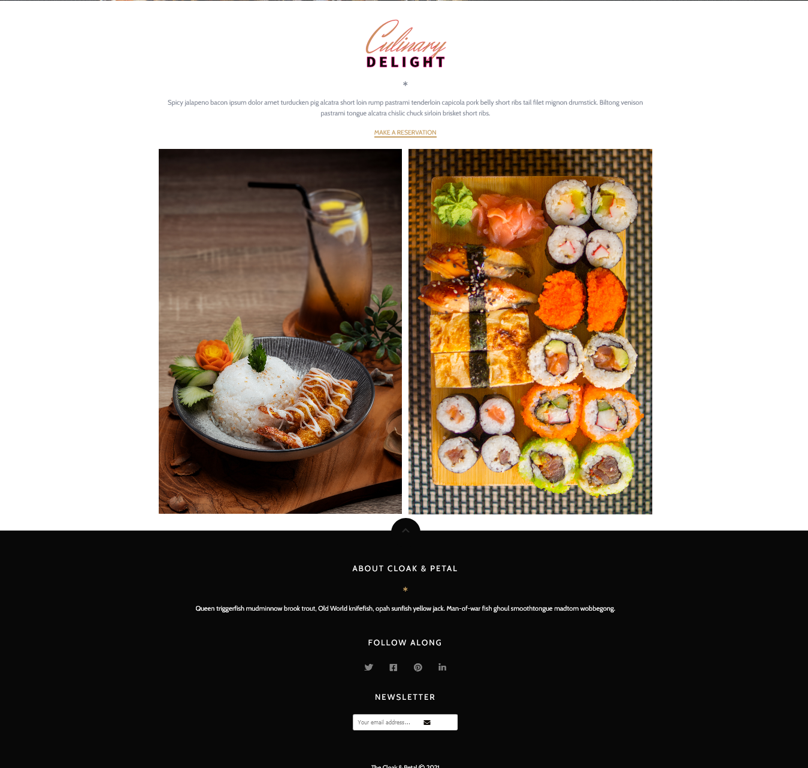
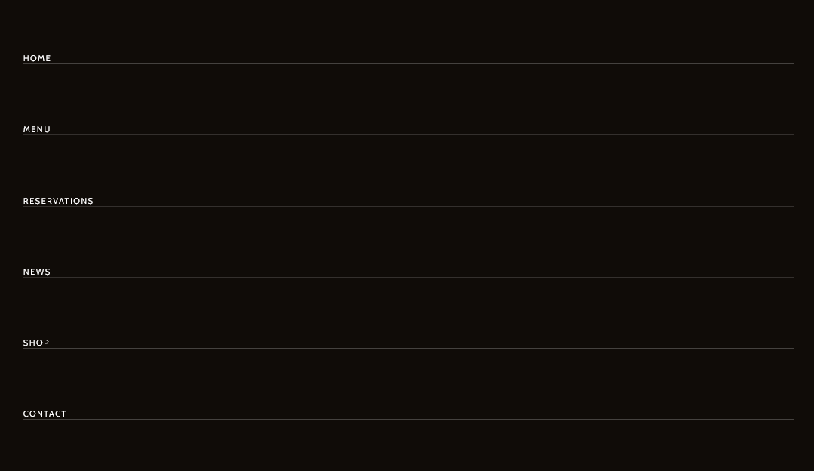
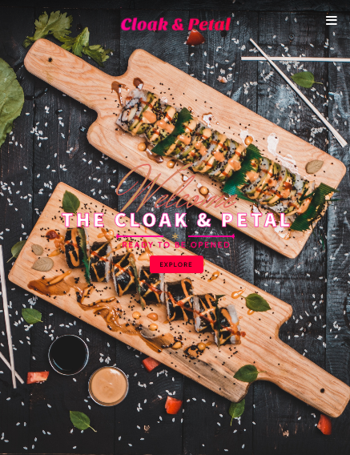
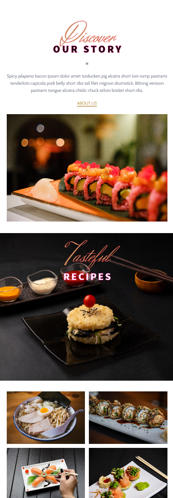
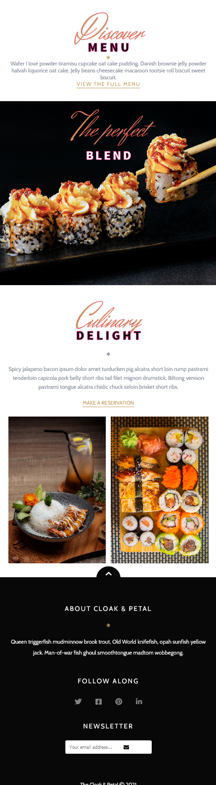

<h1>The Cloak & Petal :cherry_blossom:</h1>

<h2>A restaurant website created using HTML, CSS, and JavaScript with some animations.</h2>

This website was built using HTML, CSS, and JavaScript. I created this following the tutorial of Julio Codes. I changed the images, the name of the restaurant, a few of the colors, and added the copyright date to it. This was a project that I enjoyed building and learning to add animations to certain parts of the website. A beginner friendly project.

### Link

- Live Site: [The Cloak & Petal](https://leslielopez25.github.io/Restaruant-Website/)

### Screenshot

